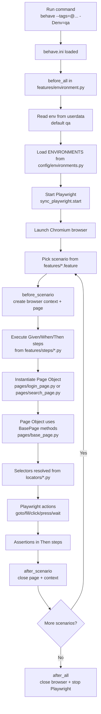

# Playwright + Behave Flow Diagram

## 1) Repository Execution Flow



## 2) Login Scenario Step Flow

```mermaid
flowchart LR
    A[login.feature\nScenario: Successful login] --> B[Given: user on OrangeHRM login page]
    B --> C[LoginPage(page, env_config)]
    C --> D[load() -> navigate(orangehrm_url)]

    D --> E[When: user logs in with username/password]
    E --> F[login(username, password)]
    F --> G[wait_for_selector USERNAME_INPUT]
    G --> H[fill username]
    H --> I[fill password]
    I --> J[click LOGIN_BUTTON]

    J --> K[Then: redirected to dashboard]
    K --> L[wait_for_load_state networkidle]
    L --> M[assert dashboard in page.url.lower]
```

## 3) Search Scenario Step Flow

```mermaid
flowchart LR
    A[search.feature\nScenario: Basic Search] --> B[Given: DuckDuckGo home page is displayed]
    B --> C[SearchPage(page, env_config)]
    C --> D[load() -> navigate(search_url)]

    D --> E[When: user searches phrase]
    E --> F[search(phrase)]
    F --> G[fill SEARCH_INPUT]
    G --> H[press Enter on SEARCH_INPUT]

    H --> I[Then: search results are shown]
    I --> J[wait_for_load_state networkidle]
    J --> K[assert phrase in page.title]
```

## 4) Code Mapping

- Feature files: `features/login.feature`, `features/search.feature`
- Hooks/lifecycle: `features/environment.py`
- Step definitions: `features/steps/login_steps.py`, `features/steps/search_steps.py`
- Page objects: `pages/login_page.py`, `pages/search_page.py`, `pages/base_page.py`
- Locators: `locators/login_locators.py`, `locators/search_locators.py`
- Environment config: `config/environments.py`
- Runner config: `behave.ini`
